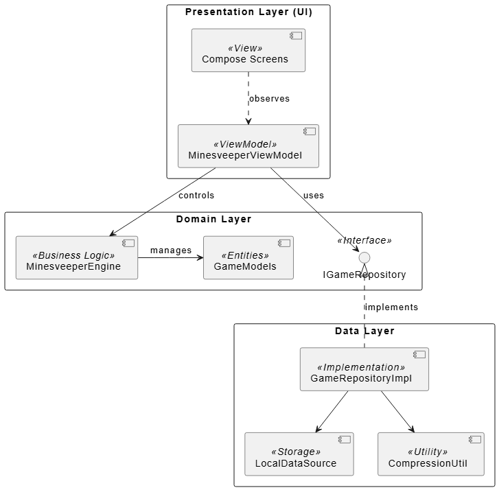
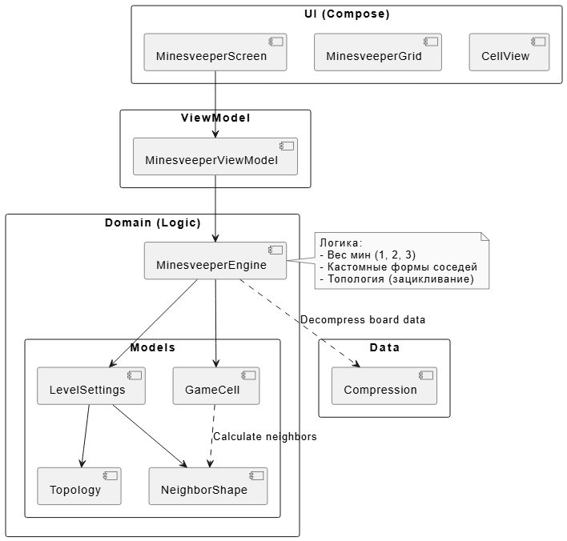

# Анализ архитектурного решения: Crazy Minesveeper

Данный отчет представляет собой исследование архитектуры мобильного приложения "Crazy Minesveeper" в рамках лабораторной работы №3. В документе описаны два состояния системы: проектируемое («To Be») и текущее («As Is»), а также проведен их сравнительный анализ.

---

## 1. Проектируемая архитектура (To Be)

На этапе проектирования закладываются фундаментальные принципы, обеспечивающие масштабируемость и легкость поддержки приложения.

*   **Тип приложения:** Mobile Application (Rich Client). Вся бизнес-логика и обработка состояний игрового поля происходят локально на устройстве для обеспечения максимальной производительности. В перспективе планируется расширение до клиент-серверной модели.
*   **Стратегия развертывания:** Standalone Deployment. Приложение поставляется как независимый пакет (APK), работающий автономно. Для реализации серверной части (бэкенда), отвечающей за хранение кастомных уровней и глобальные рейтинги, планируется использование **Java**, что обеспечит стабильность серверной логики и высокую совместимость.
*   **Обоснование технологий:**
    *   *Kotlin:* выбран за типобезопасность и лаконичность на стороне клиента.
    *   *Java:* выбрана для бэкенда как проверенное промышленное решение с развитой экосистемой для построения надежных серверных приложений.
    *   *Jetpack Compose:* современный декларативный UI для мобильного клиента.
    *   *Android Jetpack (ViewModel):* используется для управления состоянием интерфейса.
*   **Показатели качества:**
    *   *Гибкость (Flexibility):* возможность добавления новых типов ячеек и серверных функций без переписывания ядра.
    *   *Сопровождаемость (Maintainability):* четкое разделение на клиентскую и серверную части упрощает разработку.
*   **Сквозная функциональность:**
    *   *Управление состоянием:* централизовано во ViewModel на клиенте.
    *   *Взаимодействие с данными:* механизмы сериализации для обмена уровнями между клиентом и планируемым Java-бэкендом.

### Структурная схема (Функциональные блоки)
Архитектура строится на базе трех функциональных слоев на клиенте и внешнего серверного блока:
1.  **Presentation Layer:** экраны на Compose и ViewModel.
2.  **Domain Layer (Engine):** чистая бизнес-логика игры.
3.  **Data Layer:** инструменты для локального хранения и будущие API-клиенты для связи с Java-бэкендом.

*Рисунок 1. Схема функциональных слоев (To Be)*

---

## 2. Анализ текущей архитектуры (As Is)

Текущая реализация (по результатам Sprint Review 1) уже включает ключевые механизмы расширенного «Сапера», такие как:
*   Система весов для расчета окружающих мин (поддержка "двойных" бомб).
*   Абстракция топологий (поддержка зацикленных полей).
*   Свойство существования ячейки для создания полей сложной формы.

Однако, анализ кода выявил нарушение принципа разделения ответственности: игровой движок напрямую обращается к инструментам сжатия из слоя данных для подготовки игрового поля.

*Рисунок 2. Диаграмма классов текущей реализации (As Is)*

---

## 3. Сравнение и план рефакторинга

### Сравнение «As Is» и «To Be»
Целевая архитектура предполагает полную изоляцию доменного слоя (Engine) от деталей реализации данных. В текущем состоянии (`As Is`) наблюдается «протекание» ответственности. Также текущая версия полностью автономна, в то время как «To Be» модель подготавливает фундамент для интеграции с Java-бэкендом.

### Пути улучшения (Рефакторинг)
Для приведения системы к целевому виду намечены следующие шаги:
1.  **Инверсия зависимостей (DIP):** Внедрение интерфейсов (Repository/Data Provider). Это позволит в будущем легко заменить локальное хранилище на сетевое взаимодействие с Java-сервером.
2.  **Выделение стратегий:** Перенос алгоритмов автоматического открытия пустых зон в отдельные классы-стратегии.
3.  **Декомпозиция UI-компонентов:** Разделение монолитных Compose-функций на мелкие независимые элементы.

## Заключение
Проведенный анализ подтвердил, что выбранная многослойная структура является жизнеспособной. Внедрение Java в качестве технологии бэкенда позволит расширить возможности приложения до полноценного онлайн-сервиса, а намеченный рефакторинг обеспечит чистоту кода и готовность к этой интеграции.
