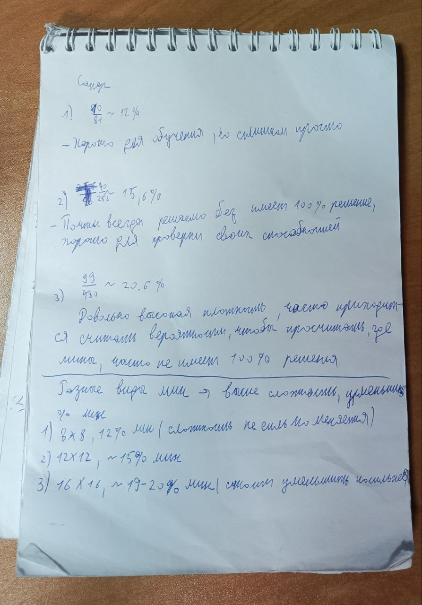

# Лабораторная работа №4: Парное программирование

## 1. Теоретическая справка

В рамках работы мы применили метод **Парного программирования**.

* **Стиль:** «Водитель-штурман».
* **Роли:** Евгений (Backend/Math) — расчет сложности и логики; Витовт (UI/UX) — дизайн-система, типографика и эргономика.

---

## 2. Математическое и инженерное обоснование

### 2.1. Эргономика (14 клеток и dp)

* **Ширина 14 клеток:** При стандартной ширине экрана **360dp**, размер одной ячейки — **25.7dp**. Это «золотая середина» для мобильного интерфейса.
* **Почему не 30?** Размер ячейки упал бы до 12dp, что физически меньше подушечки пальца (эффект «Fat Finger»). Это сделало бы игру неиграбельной без стилуса.

### 2.2. Расчет плотности мин и сложности («Профессионал»)

Для уровня «Профессионал» (16x16) мы отказались от фиксированного количества бомб в пользу **процентного распределения**. Это позволяет сохранять баланс сложности при изменении размеров поля игроком в настройках (от 5 до 50).

**Алгоритмическое обоснование лимита в 30%:**
Мы экспериментально и математически установили верхний порог плотности мин в **30%** от общего числа клеток ($N$). 
1. **Вероятность «нулевых» клеток:** При плотности $P > 0.3$, вероятность появления пустых (безопасных) областей $P(safe)$ стремится к нулю. Это превращает игру из логической задачи в угадывание (50/50), так как почти каждая цифра будет окружена максимально возможным числом мин.
2. **Связность поля:** При $P = 0.3$, согласно теории перколяции, поле все еще сохраняет «проходы». Если поднять плотность до 40-50%, игрок будет заблокирован в стартовой локации без возможности логического продвижения.

**Параметры уровня «Профессионал»:**
*   **Тип 1 (Red, 1x):** 12.0%
*   **Тип 2 (Green, 2x):** 2.0%
*   **Тип 3 (Blue, 3x):** 4.0%
*   **Тип -1 (Anti, -1x):** 2.0%
*   **Суммарная плотность:** **20.0%**. 

**Когнитивный вес (Complexity index):**
Хотя плотность составляет всего 20%, эффективная сложность $E_{eff}$ рассчитывается с учетом зарядов:
$$E_{eff} = \sum (P_i \times |Weight_i|) = (12 \times 1) + (2 \times 2) + (4 \times 3) + (2 \times 1) = \mathbf{30\% \text{ эквивалентной нагрузки}}$$
Это означает, что игроку приходится обрабатывать на 50% больше информации на ту же площадь поля по сравнению с классическим сапером.

**Расчеты на бумаге (черновик алгоритма):**

---

## 3. Обоснование дизайна и контрастности (WCAG)

Витовт выбрал цветовую схему, основываясь на международном стандарте доступности **WCAG 2.1**.

### 3.1. Сравнение контраста на белом фоне (#FFFFFF)

1. **Черный текст (21:1):** Соответствует уровню **AAA**. Используется для основных цифр.
2. **Голубой/Синий текст (8.5:1):** Соответствует уровню **AAA**.
3. **Красный текст (4.0:1):** Проходит по уровню **AA**. Используется для минных акцентов.

---

## 4. Впечатления от ПП

Работа в паре позволила нам не просто «накидать кнопок», а создать обоснованный инженерный продукт. Пока один считал «заряды» бомб и ограничивал их плотность 30-процентным барьером для сохранения логики прохождения, второй проверял, не «сломает» ли этот заряд визуальную верстку и будет ли это удобно нажимать пальцем.
