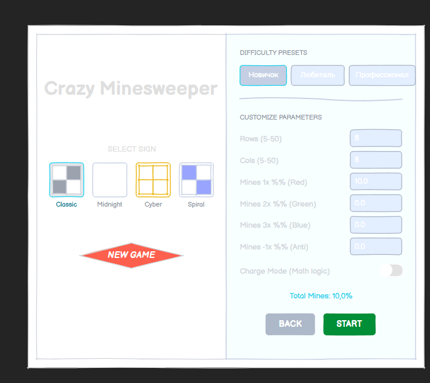
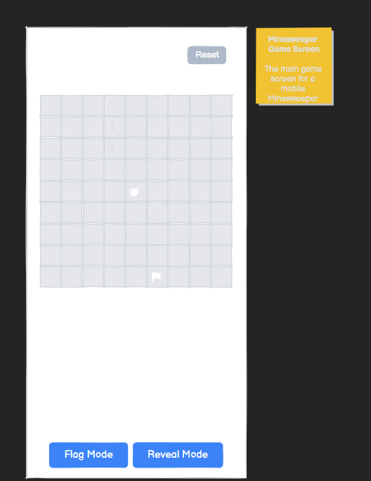

# Министерство образования Республики Беларусь

Учреждение образования  
**БЕЛОРУССКИЙ ГОСУДАРСТВЕННЫЙ УНИВЕРСИТЕТ  
ИНФОРМАТИКИ И РАДИОЭЛЕКТРОНИКИ**

**Факультет компьютерных систем и сетей**  
**Кафедра электронных вычислительных машин**

Дисциплина: Жизненный цикл разработки программного обеспечения

-----

## ОТЧЕТ

### по лабораторной работе №6

### «Улучшение UX»

### на тему

# CRAZY MINESWEEPER

-----

**Студенты:** В.А. Волосевич  
Е.С. Виршич

**Преподаватель:** О.М. Внук

-----

Минск 2026

-----

## СОДЕРЖАНИЕ

1 Оценка приложения по атрибутам Usability (ISO/IEC 25010:2011)  
2 Анализ улучшений по уровням «Опыта использования»  
3 Работа с формами и игровыми уведомлениями  
4 Проектирование интерфейса (Wireframes)  
5 Реализация логики взаимодействия и UX-улучшений  
6 Трассируемость задач (Traceability)  
7 Заключение

-----

## 1 ОЦЕНКА ПРИЛОЖЕНИЯ ПО АТРИБУТАМ USABILITY

### 1.1 Распознаваемость соответствия
**Оценка: 8/10** Визуализация игровых объектов позволяет пользователю мгновенно идентифицировать тип угрозы. Цветовая дифференциация мин в ячейках полностью синхронизирована с индикаторами в хедере интерфейса, что ускоряет считывание игровой ситуации.

### 1.2 Обучаемость
**Оценка: 7/10** Механика нескольких типов флагов требует времени на освоение. Обучаемость повышена за счет использования общепринятых паттернов мобильных интерфейсов. Контекстная цветовая индикация позволяет пользователю освоить новые механики (разные типы мин) непосредственно в процессе игры, минимизируя время на изучение документации

### 1.3 Используемость (Операбельность)
**Оценка: 8/10** Управление на полях любого размера обеспечено функциями масштабирования (Pinch-to-zoom) и панорамирования. Это минимизирует вероятность ошибочных нажатий на мобильных устройствах с небольшой диагональю.

### 1.4 Защита от ошибок пользователя
**Оценка: 9/10** Внедрена строгая валидация вводимых параметров сложности. Блокировка игровых действий в режиме паузы и тактильное подтверждение (Haptic Feedback) при установке флага исключают случайные деструктивные действия.

### 1.5 Эстетика GUI
**Оценка: 9/10** Применение высококонтрастных тем (например, «Spiral Energy» на базе Slate-оттенков) обеспечивает четкое выделение активных элементов и снижает зрительную усталость при длительных сессиях.

### 1.6 Доступность
**Оценка: 8/10** Скин «Cyber Aug» разработан специально для обеспечения максимальной контрастности (желтый на черном). Локализация всех текстовых данных через ресурсы `strings.xml` позволяет адаптировать приложение под разные регионы.

-----

## 2 АНАЛИЗ УЛУЧШЕНИЙ ПО УРОВНЯМ «ОПЫТА ИСПОЛЬЗОВАНИЯ»

1.  **Уровень стратегии (Strategy):** На самом абстрактном уровне определены ожидания пользователей: получение динамичного игрового опыта с минимизацией рутинных действий и нагрузки на зрение. Стратегия продукта сфокусирована на предоставлении «продвинутого» режима классической игры для опытной аудитории.
2.  **Уровень набора возможностей (Capability):** Сформирован список функциональных возможностей: поддержка 4-х типов мин, динамическая смена визуальных тем, система интеллектуального масштабирования поля, расчет эффективности действий игрока и многоуровневая валидация настроек.
3.  **Уровень структуры (Structure):** Описано взаимодействие между экранами. Пользователь перемещается от выбора визуального стиля в главном меню к экрану конфигурации сложности, и далее в игровое пространство. Структура спроектирована так, чтобы навигация «назад» сохраняла состояние настроек, делая процесс интуитивным.
4.  **Уровень компоновки (Layout):** Реализовано эффективное расположение элементов UI. Игровое поле занимает основное пространство, информационная панель (хедер) закреплена сверху для контроля прогресса, а управляющие кнопки вынесены в нижнюю зону досягаемости больших пальцев.
5.  **Уровень поверхности (Surface):** Визуальный слой (Surface) реализован через систему динамических стилей. Использование специализированных шрифтов и кастомных сетов иконок для мин и флагов обеспечивает высокую контрастность и интуитивное считывание игровых объектов без необходимости вчитываться в текстовые подписи

-----

## 3 РАБОТА С ФОРМАМИ И ИГРОВЫМИ УВЕДОМЛЕНИЯМИ

* **Валидация данных:** На экране «Custom Settings» внедрена проверка параметров в реальном времени. Кнопка старта деактивируется, если плотность мин превышает критический порог (80%) или размеры поля выходят за пределы 5-50 единиц.
* **Событийный отклик:** Системные уведомления заменены на кастомные диалоги (`StatsDialog`). Это поддерживает стилистическую целостность и не выбивает пользователя из игрового контекста.
* **Визуальный Onboarding:** Реализована система превью скинов (`SkinThumbnail`), позволяющая пользователю оценить интерфейс до начала игры.

-----

## 4 ПРОЕКТИРОВАНИЕ ИНТЕРФЕЙСА (WIREFRAMES)

Макеты созданы в **Balsamiq Cloud** и отражают финальную архитектуру экранов.

*Рисунок 1 — Макет экрана настроек и главного меню*

*Рисунок 2 — Макет игрового экрана*

-----

## 5 РЕАЛИЗАЦИЯ ЛОГИКИ ВЗАИМОДЕЙСТВИЯ И UX-УЛУЧШЕНИЙ

В ходе разработки основное внимание было уделено бесшовному взаимодействию пользователя с игровым миром.

### 5.1 Логика предотвращения ошибок (Error Prevention)
Для исключения ввода некорректных данных в `MainActivity.kt` применена реактивная логика состояния. Параметр `isValid` вычисляется автоматически при изменении любого текстового поля. Если данные не соответствуют бизнес-правилам (например, слишком высокая плотность мин), кнопка запуска блокируется на уровне UI, а индикатор суммарного количества мин окрашивается в предупреждающий красный цвет.

### 5.2 Масштабируемость и навигация
Реализована поддержка сложных жестов через `pointerInput` и `detectTransformGestures`. Игрок может плавно изменять масштаб сетки от 0.2x до 5x, что критически важно для полей большого размера. Логика «центрирования» позволяет быстро сбросить масштаб и вернуть камеру в исходное состояние при необходимости.

### 5.3 Мультимодальная обратная связь
UX расширен за счет использования `HapticFeedback`. Каждое значимое действие (установка флага, успешное открытие группы ячеек или взрыв) сопровождается вибрацией разной интенсивности. Это создает дополнительный канал связи с пользователем, компенсируя отсутствие тактильного отклика у сенсорных экранов.

### 5.4 Визуальная иерархия и цветовой код
Логика интерфейса построена на цветовой синхронизации. Каждому типу мины присвоен уникальный цветовой идентификатор, который сохраняется во всех элементах системы: в меню настроек, в хедере игрового экрана и в самих ячейках поля. Это позволяет игроку анализировать ситуацию периферийным зрением.

-----

## 6 ТРАССИРУЕМОСТЬ ЗАДАЧ (TRACEABILITY)

| Task ID | Описание | Файлы реализации |
| :--- | :--- | :--- |
| **UX-SKINS** | Система игровых тем и палитр | `GameSkins.kt`, `Theme.kt` |
| **UX-VALID** | Логика валидации параметров | `MainActivity.kt` |
| **UX-NOTIF** | Кастомные диалоги и уведомления | `GameScreen.kt` |
| **UX-NAV** | Зум и навигация (Pinch-to-zoom) | `GameScreen.kt` |

-----

## 7 ЗАКЛЮЧЕНИЕ

Приложение приведено в соответствие с современными требованиями к мобильному UX. Внедрение многоуровневой валидации и тактильной обратной связи позволило значительно снизить порог входа и уменьшить количество ошибок пользователя. Проектирование от «Стратегии» до «Поверхности» обеспечило логическую связность всех элементов интерфейса.

-----